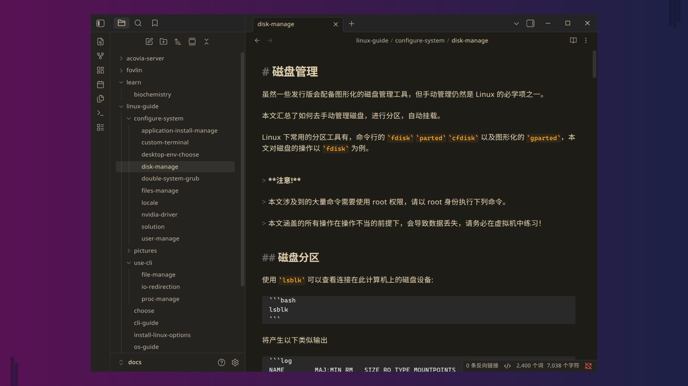
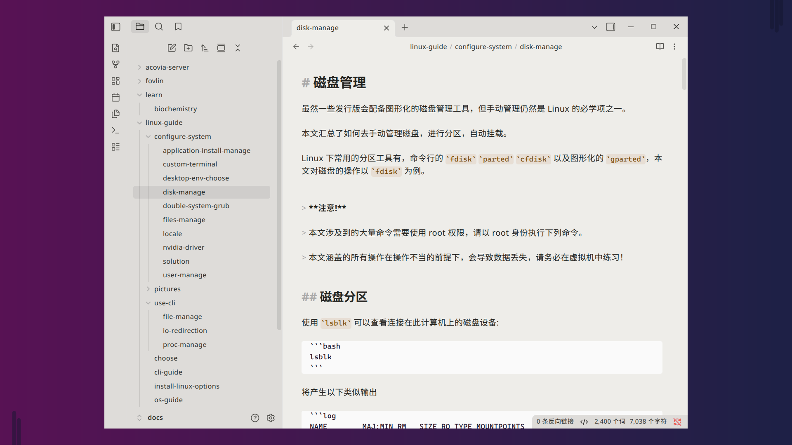

# Acovia Theme

A warm-toned theme, gentle on the eyes — especially in dark mode.

## Dark Example



# Light Example



## Installation

### Via Community Themes Browser (Recommended)

1. Open Obsidian and go to **Settings** → **Appearance**.
2. Click the **Manage** button next to the theme dropdown.
3. Search for **Acovia** in the community themes browser.
4. Click **Install** and then **Enable** to apply the theme.

### Via Git Clone (For Advanced Users)

```bash
cd /path/to/your/vault/.obsidian/themes
```

```bash
git clone https://github.com/fovlin/acovia-absidian-theme.git
```